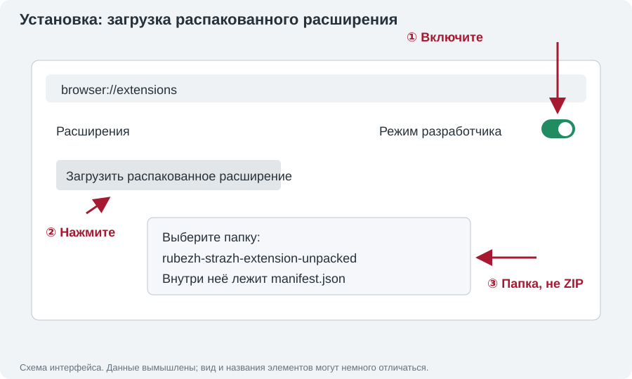
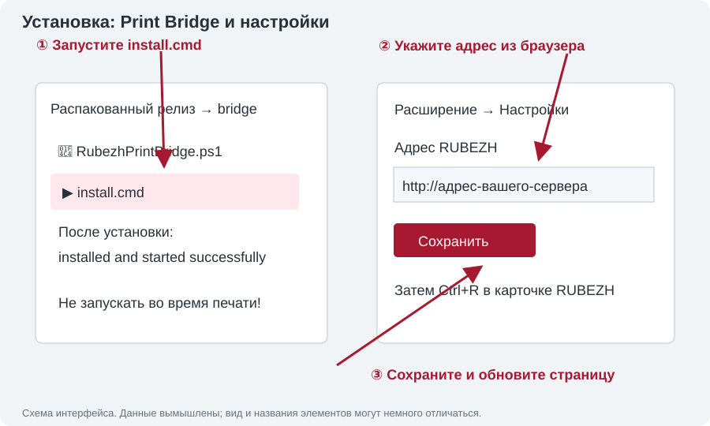

# RUBEZH STRAZH — печать пропусков из браузера

Расширение добавляет непосредственно в карточку сотрудника RUBEZH STRAZH три кнопки рядом с кнопкой сохранения:

- `Печать: сотрудник`
- `Печать: МОСН`
- `Печать: временный`

Нажатие считывает уже введённые ФИО, должность, подразделение и табельный номер и открывает предварительный просмотр карты CR80 размером 85,6 × 54 мм. Для пропуска сотрудника или МОСН нужно выбрать исходный локальный файл фотографии JPG, PNG, WebP или BMP: фотография со страницы намеренно не используется. Пока файл не выбран и макет не сформирован, кнопка печати заблокирована. После проверки карта отправляется через локальный Print Bridge в IDP SMART. Стандартное окно печати браузера не используется.

Персональные данные не покидают компьютер: расширение обращается только к локальному адресу `127.0.0.1`.

## Установка

### 1. Подготовьте Windows и файлы

Нужен компьютер Windows с Яндекс Браузером, установленными SMART iDesigner и драйвером SMART-51. Принтер должен определяться в Windows; в iDesigner должна работать печать с вашим профилем hYMCKO. Расширение не устанавливает и не обновляет драйвер принтера, не исправляет неисправность ленты. Если iDesigner также выдаёт ошибки, сначала решите их с ответственным за принтер. Для С/М данный CSD-путь требует ленту hYMCKO.

Скачайте ZIP **распакованного расширения** со страницы [Releases](https://github.com/chikbob/rubezh-strazh-extension/releases), не архив исходного кода Source code. В Проводнике нажмите правой кнопкой на ZIP → «Извлечь всё». Выберите постоянную папку, например «Документы → RubezhPrinter», и полностью распакуйте архив. Не запускайте файлы из окна ZIP и не удаляйте папку после установки: браузер использует её при работе.

Внутри папки `rubezh-strazh-extension-unpacked` должны лежать `manifest.json`, `src`, `bridge`, `README.md` и `INSTALL-RU.txt`. Если видна только ещё одна папка с таким названием, откройте её: выбирать нужно именно уровень с `manifest.json`.

### 2. Подключите расширение в браузере



1. В адресную строку Яндекс Браузера вставьте `browser://extensions`, нажмите Enter.
2. Включите «Режим разработчика» (стрелка ① на схеме).
3. Нажмите «Загрузить распакованное расширение» (②).
4. Выберите папку `rubezh-strazh-extension-unpacked`, где лежит `manifest.json` (③), подтвердите выбор.
5. Убедитесь, что «RUBEZH STRAZH — печать пропусков» включено. Если браузер сообщает об отсутствии manifest, выбрана не та папка.
6. При необходимости откройте меню расширений возле адресной строки и закрепите значок расширения. Через него доступны «Инструкция» и «Настройки».

Схемы со стрелками иллюстрируют действия; это не снимки конкретного компьютера. Названия пунктов браузера могут немного отличаться.

### 3. Установите локальный Print Bridge



Дождитесь, когда принтер **готов и неподвижен**, завершите задания iDesigner/Windows. Установщик останавливает старый мост: запускать его во время печати нельзя.

1. Откройте распакованный релиз → папку `bridge`.
2. Дважды щёлкните `install.cmd` (стрелка ①). Не запускайте `RubezhPrintBridge.ps1` вместо установщика.
3. Дождитесь сообщения `RUBEZH Print Bridge installed and started successfully.`. При сообщении `SmartComm2.dll was not found` проверьте установку SMART iDesigner. Не скачивайте DLL с посторонних сайтов и не отключайте защиту Windows ради запуска; ограничения рабочего компьютера решает администратор.
4. Установщик копирует мост и SDK из установленного iDesigner в `%LOCALAPPDATA%\RubezhPrintBridge`, запускает мост и включает автозапуск при входе в Windows. Он не прошивает принтер и не меняет сервисную калибровку.
5. При желании откройте в браузере `http://127.0.0.1:18451/health`: ответ JSON должен содержать `ok: true`, имя принтера и `protocolVersion: 8`. Это проверка связи, не печать. Если адрес не открывается — мост не запущен; если версия другая — установлен старый мост.

Если подключено несколько принтеров, мост по умолчанию выбирает первый подходящий. Для явного выбора создайте текстовый `printer.txt` в `%LOCALAPPDATA%\RubezhPrintBridge` с точным именем очереди Windows. Проверяйте имя в ответе health. Не делайте контрольную печать, если выбрано не то устройство.

### 4. Укажите адрес RUBEZH

Откройте значок расширения → «Настройки». Скопируйте адрес вашего сервера из адресной строки RUBEZH: протокол, имя/IP и порт, если есть, без пути страницы человека. Например, `http://10.250.225.22` — только пример, используйте ваш фактический адрес. Нажмите «Сохранить» (стрелки ②–③). Авторизация в RUBEZH выполняется обычным способом; расширению не нужно вводить пароль.

Откройте карточку человека и нажмите `Ctrl+R`. Рядом с сохранением должны появиться С/М/В. Если кнопок нет, проверьте совпадение адреса и что это карточка человека, а не общий список. После каждой перезагрузки/обновления расширения обновляйте уже открытые вкладки RUBEZH.

### 5. Обновление и диагностика

Для обновления распакуйте новую версию полностью в постоянную папку; не смешивайте отдельные файлы из разных релизов. Если сменили папку, подключите новое распакованное расширение и отключите старую копию. Если путь тот же — нажмите перезагрузку расширения на странице расширений. Для rc.7 нужно также установить новый мост через `bridge\install.cmd`: протокол изменился с 7 на 8. Затем обновите RUBEZH.

Не используйте автоматический повтор после сбоя: сохраните лог, проверьте принтер и только при готовом неподвижном устройстве перезапускайте мост. Лог доступен через Win+R → `%LOCALAPPDATA%\RubezhPrintBridge` → `bridge.log`. Автозапуск отключается `bridge\disable-autostart.cmd`, включается `bridge\enable-autostart.cmd`; отключение применяется при следующем входе и не останавливает текущий процесс.

### Работа после установки

Нажмите значок расширения → **«Инструкция»**: подробная инструкция с иллюстрациями откроется в новой вкладке. Её также можно открыть из распакованного релиза: [src/help.html](src/help.html). Там описаны С/М/В, фото, идентификаторы, перенос/правка текста, печать и действия при ошибке.

После одноразовой установки моста кнопки `С`, `М` и `В` открывают предпросмотр. Для `С` и `М` выберите исходный файл фото, проверьте обновлённый макет и нажмите «Печать». Временный пропуск фотографии не содержит. Мост запускается автоматически при входе в Windows и выбирает первый установленный IDP SMART-51/31/21. Чтобы явно выбрать очередь, запишите её точное имя в `%LOCALAPPDATA%\RubezhPrintBridge\printer.txt`.

После установки, обновления или перезапуска расширения обязательно один раз обновите уже открытую вкладку RUBEZH (`Ctrl+R`). Браузер аннулирует контекст старого скрипта страницы; расширение перехватывает это состояние и выводит понятное уведомление вместо необработанной ошибки.

Автозапуск включается установщиком автоматически. Для управления им запустите `bridge\disable-autostart.cmd` или `bridge\enable-autostart.cmd`. Отключение автозапуска не останавливает уже работающий мост; изменение применяется при следующем входе в Windows.

Диагностика заданий записывается в `%LOCALAPPDATA%\RubezhPrintBridge\bridge.log`. Мост не перематывает ленту и не меняет сервисную калибровку принтера.

## Проверочная версия 2.8.0-rc.7

С/М используют два отдельных текстовых объекта CSD для должности/комментария. Второй объект — копия первого с тем же Arial, размером, выравниванием, отступами и панелью печати; он расположен над табельным номером. Если продолжение не требуется, второй объект пустой. Внутри каждого объекта нет символа переноса: SDK объединял строки в rc.6, несмотря на увеличение высоты. Сокращения, границы слов и измерение ширины выполняются до SDK-предпросмотра. Настройки принтера, фото и остальные поля не меняются. Мост отклоняет третью строку. Требуется протокол 8, поэтому мост и расширение обновляются вместе. Физический отпечаток нужно подтвердить на принтере; до печати проверьте обе строки в SDK-предпросмотре.

«Оператор», «Медицинская сестра», «Младшая» сокращаются автоматически даже в короткой строке. Словарь включает медицинские, административные, бухгалтерские и IT-термины; остальные известные слова сокращаются при нехватке ширины. Специальности и неизвестные слова не обрезаются. Перенос — по пробелам или существующему дефису; размер шрифта не уменьшается. Для МОСН берётся комментарий, при его отсутствии — должность. Ручная правка сохранена, Enter задаёт перенос. Данные RUBEZH не изменяются.

Словарь — локальные понятные сокращения, не перечень официально стандартизованных названий должностей. Общий принцип графического отсечения: конец на согласной с точкой, сохранение границ слов и смысла; неизвестные слова не сокращаются автоматически. Основа: [правила графических сокращений, Грамота.ру](https://gramota.ru/biblioteka/spravochniki/pravila-russkoy-orfografii-i-punktuatsii/graficheskie-sokrashcheniya). Проверяйте итоговый смысл и SDK-предпросмотр перед печатью.

## История: проверочная версия 2.8.0-rc.4

Длинные должности С/М сокращаются до подстановки в CSD: например, «Заместитель главного врача по экономическим вопросам» → «Зам. глав. врача по экон. вопр.». Короткие названия сохраняются. Строка измеряется обычным Arial в масштабе исходного поля; шрифт, размер и объекты CSD не изменяются. Неизвестное слишком длинное название не обрезается: печать блокируется, а поле «Должность на пропуске» позволяет сократить его вручную и нажать «Применить». Изменения действуют только для этого пропуска и не записываются в RUBEZH. После правки требуется новый SDK-предпросмотр; старая версия не может уйти в печать.

Мост и протокол 6 остались без изменений относительно rc.3. Если мост rc.3 уже установлен, повторная установка не нужна. Качество физического отпечатка требует проверки на принтере. Подробная иллюстрированная инструкция запланирована отдельно после подтверждения стабильности.

## История: проверочная версия 2.8.0-rc.3

Для С/М мост теперь открывает подготовленную копию присланного рабочего `.csd` через `SmartComm_OpenDocument`. Текст и исходная фотография подставляются в конкретные поля этой версии шаблона; остальные байты объектов, фона, эмблемы и сохранённых параметров остаются неизменными. Исходный пользовательский файл не изменяется. В релиз включена обезличенная копия без исходных ФИО, номера и портрета. Целостность проверяется SHA-256; произвольные CSD не поддерживаются.

Фото вписывается с обрезкой в исходное поле 386×502 на белой подложке **без дополнительного фильтра контраста/яркости**. Для С/М отдельные DrawImage/DrawText и перезапись настроек драйвера больше не вызываются. Временный пропуск остаётся без фото на прежнем объектном пути.

После выбора фото окно запрашивает **предпросмотр самого SDK**, без команды Print. Только успешная загрузка и отрисовка CSD разрешают печать; при ошибке кнопка заблокирована. Затем по отдельному подтверждению отправляется одна печать. Защита от дублей и блокировка после неподтверждённого задания сохранены.

Требуется протокол 6: обновите расширение и мост вместе. Запускайте `bridge\install.cmd` из нового архива **только при готовом и неподвижном принтере**, затем перезагрузите расширение и вкладку RUBEZH. Сначала проверьте полученный SDK-предпросмотр. Это предварительная версия: загрузка изменённой копии CSD и физическое качество на вашем SMART-51 ещё не подтверждены. Локальные и Windows-тесты используют имитацию устройства; они не гарантируют отсутствие механического сбоя. При ошибке или неприятных звуках прекратите проверку, не отправляйте повторное задание вслепую и сохраните лог. Персональные данные и фото в лог не записываются.

## История: проверочная версия 2.8.0-rc.2

Путь печати заменён: расширение отправляет отдельные изображения фона, выбранного фото и эмблемы, а строки текста печатаются через `SmartComm_DrawText` (Arial, нативная K-панель). Полноразмерные YMC/K-растры больше не отправляются. Цветные изображения ограничены левой половиной карточки (не более 506 пикселей по X), все объекты — сеткой 1012×636. Мост проверяет план до открытия устройства и возвращённые SDK границы до команды Print. Поле фото обязательно для С/М, временный пропуск по-прежнему без фото. При совпадении настроек с профилем SDK не получает лишних вызовов изменения/восстановления параметров.

Протокол 5 требует обновить мост и расширение вместе. **Когда принтер готов и не печатает**, запустите `bridge\install.cmd` из нового архива, перезагрузите расширение и вкладку RUBEZH. Установка перезапустит мост и снимет блокировку старого неподтверждённого задания. После новой ошибки защита от повторной отправки остаётся действующей. Источник ошибки и качество результата проверяются одной физической контрольной печатью; её успех пока не подтверждён. ФИО, номер пропуска и фото не записываются в лог, только типы/границы объектов и параметры драйвера.

Используется нативное объектное рисование SDK, **не** подмена содержимого бинарного `.csd`: присланный статический шаблон не был переписан. Контраст исходных фотографий не повышен. Текст может немного отличаться от браузерного предпросмотра из-за метрик шрифта Windows; границы SDK проверяются до печати.

## История: проверочная версия 2.8.0-rc.1

В мост включён профиль `sotrudnikiHymcko.sd1`, экспортированный из рабочего iDesigner. Это не новый драйвер. Перед печатью мост проверяет целостность файла, совместимость структуры SMART51_DEVMODE/OEMDEV51, ленту hYMCKO и копирует только именованные настройки печати из профиля (в том числе исходную плотность 0). Служебные, зарезервированные, калибровочные и кодирующие поля не заменяются. Применённые параметры читаются обратно; при несовпадении печать не отправляется. Полные белые исходные панели сохранены; SDK-прямоугольники ограничены документированной сеткой SMART-51 1012×636. Контраст изображения и макет не изменены.

Установщик копирует SDK и, при наличии, SmartComm2.ini/ICM из установленного iDesigner. Обновите мост через `bridge\install.cmd` **только когда принтер не печатает**, затем перезагрузите расширение и вкладку RUBEZH. Протокол 4 блокирует использование старого моста. Настройки до задания и подтверждённые параметры профиля записываются в лог. После завершённой печати исходные настройки возвращаются только при готовом принтере. После ошибки/таймаута настройки не восстанавливаются во время неопределённого состояния, новые задания блокируются до проверки принтера и перезапуска моста.

Это предварительный релиз: тесты выполняются с имитацией SDK, а не с физическим SMART-51. Исправление `Ribbon Seek Err` и качество цветов пока не подтверждены контрольной печатью. Для проверки выполните только одну печать; при ошибке не нажимайте Retry и сохраните `%LOCALAPPDATA%\RubezhPrintBridge\bridge.log`. Если структура установленного драйвера отличается, мост безопасно откажет до печати, а не станет подбирать смещения.

## История: обновление до 2.7.2

Обновите **и расширение, и мост**: дождитесь остановки принтера, запустите `bridge\install.cmd` из нового архива, перезагрузите расширение и обновите вкладку RUBEZH (`Ctrl+R`). Новый формат панелей несовместим со старым мостом; расширение проверяет версию протокола до отправки задания.

Идентификаторы читаются только из видимого блока «Управление картами» текущего сотрудника/посетителя. Скрытые карточки и общий список не используются. Добавленные и удалённые коды обновляются в предпросмотре каждые две секунды и проверяются перед печатью. Отдельные окна не перезаписывают данные друг друга. Если кодов нет или в исходной вкладке открыт другой человек, печать заблокирована.

В 2.7.2 отменена обрезка YMC-изображения из 2.7.1: обе панели передаются полноразмерными (1012×638 пикселей), с явно белой подложкой. Цветные объекты остаются только слева, а текст и чёрная эмблема — на отдельной K-панели. Это ограниченный откат после отчёта о жёлтой полосе; причина дефекта по одному логу окончательно не установлена. Размер и координаты обеих панелей заданы явно, независимо от DPI в профиле. Мост не меняет плотность через DEVMODE, проверяет ошибки/занятость до отправки и ждёт остановки механизмов и освобождения буфера после неё. В пределах текущего запуска моста повторное HTTP-задание с тем же ID не запускает вторую печать.

Лог успешного задания означает отсутствие сообщённой SDK ошибки, но не подтверждает правильность цветов на физической карточке. В диагностику добавлены размеры подготовленных панелей и возвращённые SDK прямоугольники рисования. Фото и ФИО в лог не сохраняются.

Сообщение `Ribbon Seek Err` означает сбой поиска панели ленты. Возможны проблемы кассеты, датчика или несоответствие фактической ленты профилю (`hYMCKO` в рабочих шаблонах). Не отправляйте частично напечатанную карточку повторно вслепую. При ошибке или таймауте окно не сообщает об успехе и блокирует повторную отправку; проверьте дисплей и сохраните `%LOCALAPPDATA%\RubezhPrintBridge\bridge.log`. Мост не перематывает ленту, не сбрасывает ошибки и не меняет сервисную калибровку.

Автотесты проверяют DOM/UI, состояния SDK и 100 последовательных заданий с подменённым устройством, включая дубли и очистку ресурсов. Они не заменяют проверку серии отпечатков на физическом SMART-51.

## Разработка

```bash
npm ci
npm run typecheck
npm run build
npm test
# PowerShell: tests/bridge-status.tests.ps1 (без подключения принтера)
```
