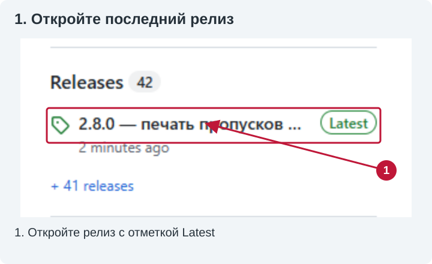
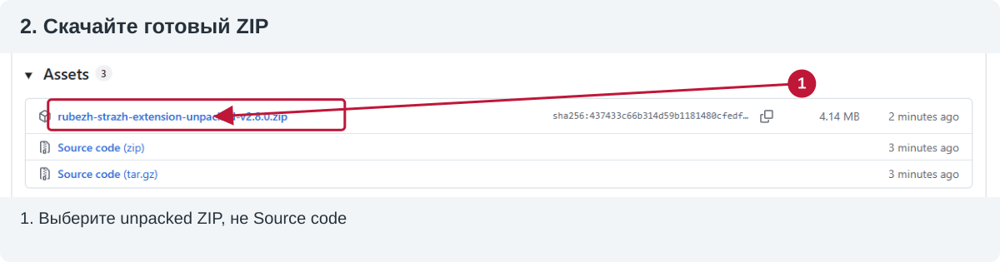
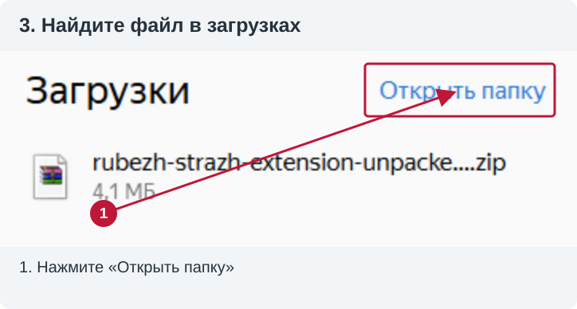
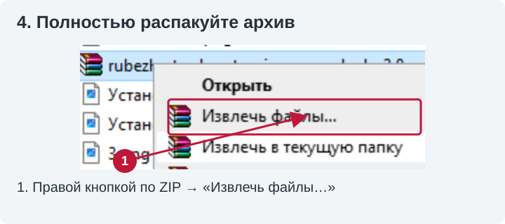
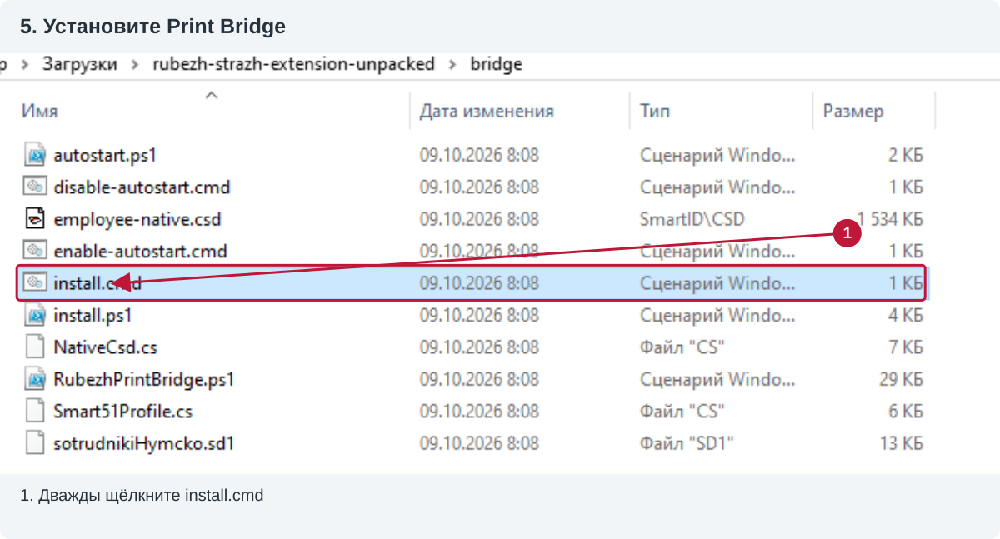
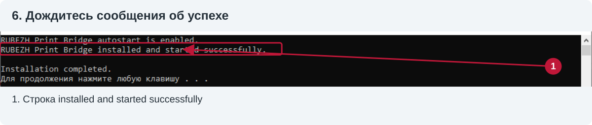
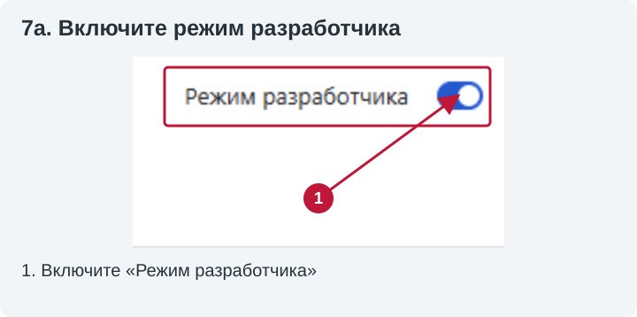
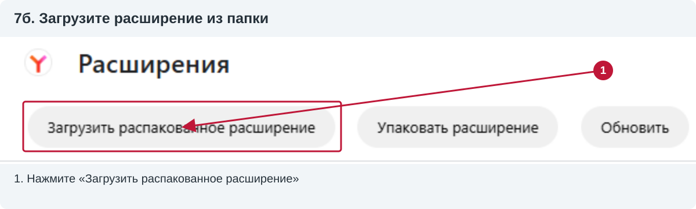
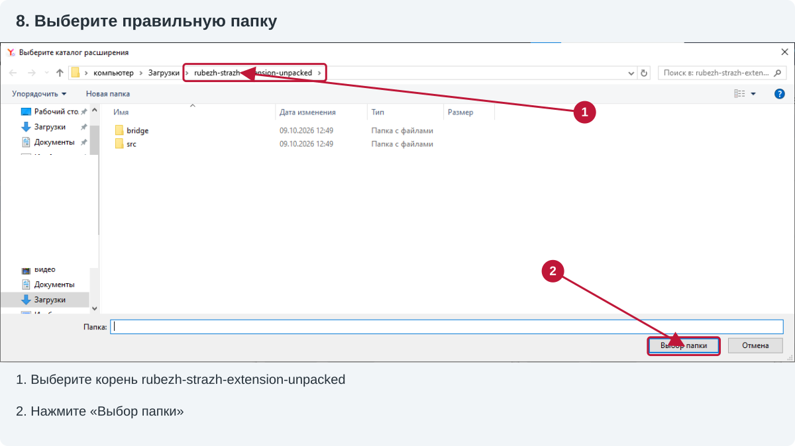
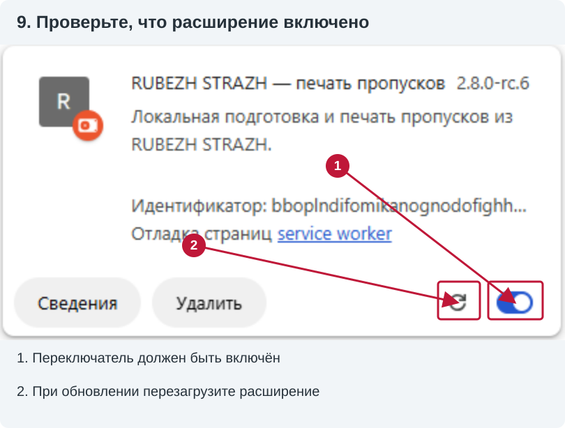

# RUBEZH STRAZH — печать пропусков из браузера

Расширение добавляет непосредственно в карточку сотрудника RUBEZH STRAZH три кнопки рядом с кнопкой сохранения:

- `Печать: сотрудник`
- `Печать: МОСН`
- `Печать: временный`

Нажатие считывает уже введённые ФИО, должность, подразделение и табельный номер и открывает предварительный просмотр карты CR80 размером 85,6 × 54 мм. Для пропуска сотрудника или МОСН нужно выбрать исходный локальный файл фотографии JPG, PNG, WebP или BMP: фотография со страницы намеренно не используется. Пока файл не выбран и макет не сформирован, кнопка печати заблокирована. После проверки карта отправляется через локальный Print Bridge в IDP SMART. Стандартное окно печати браузера не используется.

Персональные данные не покидают компьютер: расширение обращается только к локальному адресу `127.0.0.1`.

## Установка в Яндекс Браузер

Пошаговая инструкция основана на ваших снимках. Красные рамки, стрелки и номера добавлены для пояснения. На некоторых снимках показана ранняя rc-версия: номер на вашем компьютере может отличаться, ориентируйтесь на скачанный релиз. Снимки обезличены; исходные фото не входят в инструкцию.

Можно открыть ту же инструкцию как страницу с крупными картинками: [src/install.html](src/install.html). Руководство по ежедневной работе находится отдельно: [src/help.html](src/help.html).

### 1. Подготовьте компьютер

Нужен Windows-компьютер с Яндекс Браузером, установленными SMART iDesigner и драйвером IDP SMART-51. Принтер должен определяться в Windows. Прежде чем работать через расширение, убедитесь, что ваш принтер работает из iDesigner с профилем hYMCKO. Расширение не устанавливает драйвер, не прошивает принтер и не исправляет неисправную ленту.

Дождитесь окончания всех заданий: принтер должен быть готов и неподвижен. Если на дисплее ошибка, сначала обратитесь к ответственному за принтер. Не запускайте установку моста во время печати.

### 2. Скачайте готовый архив релиза

1. Откройте [страницу проекта](https://github.com/chikbob/rubezh-strazh-extension) и справа найдите **Releases**.
2. Нажмите релиз с отметкой **Latest**.



3. В разделе **Assets** нажмите файл вида `rubezh-strazh-extension-unpacked-v2.8.0.zip`. Для более новой версии номер в имени будет другой.
4. **Не скачивайте Source code (zip/tar.gz)** для обычной установки: это исходники, не готовый комплект.



### 3. Найдите ZIP и полностью распакуйте его

1. Дождитесь завершения загрузки. В загрузках браузера нажмите **«Открыть папку»**.



2. В Проводнике щёлкните правой кнопкой по ZIP → **«Извлечь файлы…»** (на снимке WinRAR) или **«Извлечь всё»** (средство Windows).
3. Выберите постоянную папку, например `Документы\RubezhPrinter`, и распакуйте архив целиком. Содержимое архива нельзя запускать прямо из окна ZIP.



4. Откройте папку `rubezh-strazh-extension-unpacked`. Непосредственно в ней должны лежать `manifest.json`, папки `src` и `bridge`, `README.md`, `INSTALL-RU.txt`.
5. Если внутри есть ещё одна одноимённая папка, откройте её: нужен уровень с `manifest.json`. Не выбирайте папку `src` или `bridge` вместо корня расширения.
6. Не удаляйте и не перемещайте эту папку после подключения: браузер читает файлы из неё. Снимки показывают «Загрузки», но постоянная отдельная папка удобнее, чем очищаемая папка загрузок.

### 4. Установите локальный Print Bridge

1. В распакованном комплекте откройте папку **bridge**.
2. При готовом неподвижном принтере дважды щёлкните **install.cmd**. Это установщик. Не запускайте вместо него `install.ps1`, `RubezhPrintBridge.ps1` или `.cs`-файлы.



3. Дождитесь сообщения **RUBEZH Print Bridge installed and started successfully.** и **Installation completed.**
4. Когда установщик пишет «Для продолжения нажмите любую клавишу…», нажмите любую клавишу и закройте это окно. Постоянно держать его открытым не требуется.



Установщик копирует мост и SDK из установленного iDesigner в `%LOCALAPPDATA%\RubezhPrintBridge`, запускает мост и включает автозапуск при входе в Windows. При обновлении он останавливает старый мост — поэтому установка запрещена во время движения принтера.

Если показано **SmartComm2.dll was not found**, установите/проверьте SMART iDesigner. Не скачивайте DLL со случайных сайтов. Если запуск ограничен политикой рабочего компьютера, обратитесь к администратору; не отключайте защиту ради установки.

### 5. Подключите распакованное расширение

1. В адресную строку Яндекс Браузера вставьте `browser://extensions` и нажмите Enter.
2. В правом верхнем углу включите **«Режим разработчика»**.



3. Нажмите **«Загрузить распакованное расширение»** слева сверху. Не «Упаковать расширение» и не «Обновить».



4. В окне выбора папки откройте **rubezh-strazh-extension-unpacked** и нажмите **«Выбор папки»**.



В этом диалоге показываются папки, поэтому `manifest.json` может быть не виден — это нормально. Его наличие проверяют обычным Проводником. Если браузер сообщает, что manifest отсутствует, выбран неверный уровень папки или архив распакован не полностью.

5. Найдите карточку **RUBEZH STRAZH — печать пропусков**. Убедитесь, что переключатель включён и нет ошибки загрузки.
6. На снимке ниже ранняя версия `2.8.0-rc.6`; для релиза 2.8.0 должна быть версия 2.8.0. Проверяйте установленную копию, а не номер в иллюстрации.



### 6. Укажите адрес сервера и обновите RUBEZH

1. Откройте значок расширения возле адресной строки → **«Настройки»**. Если значок скрыт, найдите его в меню расширений и при желании закрепите.
2. В поле **«Адрес RUBEZH»** укажите фактический адрес вашего сервера: протокол, имя/IP и порт, если есть. Например, `http://10.250.225.16` — только пример со снимков, не адрес для всех установок. Не добавляйте путь страницы человека.
3. Нажмите **«Сохранить»**. Дождитесь сообщения «Настройки сохранены. Обновите страницу RUBEZH».
4. Вернитесь в RUBEZH, войдите обычным способом, откройте карточку человека и нажмите **Ctrl+R**. Рядом с кнопкой сохранения должны появиться **С / М / В**.


Эта последняя иллюстрация — схема настроек, а остальные — обработанные снимки вашего интерфейса. Пароль RUBEZH в расширение не вводится. Рабочий порядок после установки: значок расширения → **«Инструкция»** или [src/help.html](src/help.html).

### 7. Проверьте связь без печати

Откройте `http://127.0.0.1:18451/health` в браузере. Для 2.8.0 ответ должен содержать `ok: true`, имя выбранного принтера и `protocolVersion: 9`. Это только проверка связи, карточка не печатается. Если адрес не открывается — мост недоступен; если протокол другой — используется старый мост.

Мост по умолчанию выбирает первый найденный подходящий принтер SDK. Если принтеров несколько, ответ health поможет проверить выбор. Для явного выбора запишите точное описание нужного устройства, возвращаемое SDK, в файл `%LOCALAPPDATA%\RubezhPrintBridge\printer.txt`. Не подставляйте произвольное название очереди Windows: описание должно соответствовать устройству SDK в вашей системе. Не делайте контрольную печать на неизвестном устройстве.

### 8. Как обновлять комплект

1. Дождитесь готовности и остановки принтера.
2. Полностью распакуйте новую версию в постоянную папку. Не смешивайте отдельные файлы разных версий.
3. Запустите **bridge\install.cmd** из нового комплекта. Для 2.8.0 нужны расширение и мост с протоколом 9; версия rc.8 использовала тот же протокол.
4. Если путь папки прежний, нажмите круговую стрелку **перезагрузки** на карточке расширения (вторая отметка на снимке шага 5). Если путь изменился, подключите новую папку и отключите старую копию.
5. Обновите открытые вкладки RUBEZH (**Ctrl+R**), сохраните правильный адрес сервера в настройках и проверьте health.

Не перезагружайте расширение и не переустанавливайте мост, пока задание выполняется.

### 9. Если установка не удалась

- **Нет кнопок С/М/В:** откройте карточку, не общий список; проверьте включение расширения и адрес сервера, нажмите Ctrl+R.
- **Нет manifest / не удалось загрузить:** распакуйте архив целиком и выбирайте папку с `manifest.json`, не ZIP и не `src`/`bridge`.
- **Мост недоступен:** при простаивающем принтере проверьте установку моста и health; сохраните текст ошибки. Не перезапускайте его во время печати.
- **Профиль драйвера отличается / печать не подтверждена:** не обходите проверку повторной печатью, передайте лог ответственному за принтер.
- **Где лог:** Win+R → `%LOCALAPPDATA%\RubezhPrintBridge` → **bridge.log**. Передайте свежий файл, время попытки, сообщение/фото дисплея; не используйте старую копию из папки проекта.
- **Автозапуск:** отключается `bridge\disable-autostart.cmd`, включается `bridge\enable-autostart.cmd`. Отключение применяется при следующем входе в Windows и само по себе не останавливает текущий процесс.

### Работа после установки

Откройте значок расширения → **«Инструкция»**. Руководство с вашими снимками и стрелками откроется в новой вкладке. В распакованном комплекте оно находится в [src/help.html](src/help.html). Установка и работа описаны отдельно.

## Релиз 2.8.1

Добавлена явная проверка готовности после Cancel: оператор подтверждает выдачу карточки, мост проверяет пустую очередь Windows, стабильное состояние без ошибок, датчики карточки и доступную ленту. Проверка не печатает и не двигает механизм, не меняет настройки. Блокировка снимается только при успешной проверке; история заданий сохраняется, старое задание не отправляется повторно. Перезапуск моста для такой проверки больше не требуется.

Обновлены обе инструкции с обезличенными снимками интерфейса, стрелками и подписями: установка в README и `src/install.html`, работа в `src/help.html`. При обновлении необходимо обновить и мост, и расширение. Протокол остаётся 9; старый мост не поддерживает кнопку восстановления.

Сборка и автоматические тесты пройдены. Причина аппаратного Ribbon Seek Err и необычного звука этим релизом не считается устранённой: восстановление проверяет состояние, а не ремонтирует ленту или принтер. Физическая проверка на пользовательском принтере остаётся необходимой.

## Релиз 2.8.0

Версия опубликована без отметки prerelease по запросу пользователя. Функциональный состав соответствует rc.8: свежие идентификаторы текущей карточки, обязательное исходное фото для С/М, редактируемые сокращения и две строки должности/комментария в отдельных объектах CSD, раздельные сеансы SDK для предпросмотра и печати. Протокол остаётся 9. В текущей версии документации установка и работа с фотографиями описаны в отдельных иллюстрированных руководствах выше.

Автоматические проверки пройдены, но устранение последнего дефекта физической печати без чёрного текста/эмблемы пока не подтверждено на принтере. Статус GitHub-релиза не является подтверждением исправности устройства; при ошибке ленты не повторяйте печать вслепую.

## История: проверочная версия 2.8.0-rc.8

В rc.7 SDK-предпросмотр отображает обе строки, но получен физический отпечаток без текста и эмблемы (объектов чёрной панели). По одному фото нельзя установить, потеряна ли панель программно или произошёл сбой переноса K на принтере. Свежий лог этого задания необходим для подтверждения причины.

Предпросмотр и печать теперь используют независимые сеансы SDK. Перед отправкой полностью закрываются документ и устройство предпросмотра; затем CSD открывается на свежем устройстве и печатается без `GetPreviewBitmap`, как в штатном Driver-CSD примере IDP. Перед и после открытия CSD параметры драйвера только читаются и сравниваются с присланным рабочим профилем iDesigner; несовпадение блокирует отправку. Плотность, калибровка, лента и настройки принтера автоматически не меняются. В лог добавлены параметры resin/чёрной панели, результат Print и конечный/ошибочный статус. Автоповтора нет. Требуется протокол 9 и обновление обоих компонентов. Исправление изоляции сеансов проверено автоматическими тестами; устранение дефекта физической печати пока не подтверждено.

## История: проверочная версия 2.8.0-rc.7

С/М используют два отдельных текстовых объекта CSD для должности/комментария. Второй объект — копия первого с тем же Arial, размером, выравниванием, отступами и панелью печати; он расположен над табельным номером. Если продолжение не требуется, второй объект пустой. Внутри каждого объекта нет символа переноса: SDK объединял строки в rc.6, несмотря на увеличение высоты. Сокращения, границы слов и измерение ширины выполняются до SDK-предпросмотра. Настройки принтера, фото и остальные поля не меняются. Мост отклоняет третью строку. Требуется протокол 8, поэтому мост и расширение обновляются вместе. Физический отпечаток нужно подтвердить на принтере; до печати проверьте обе строки в SDK-предпросмотре.

«Оператор», «Медицинская сестра», «Младшая» сокращаются автоматически даже в короткой строке. Словарь включает медицинские, административные, бухгалтерские и IT-термины; остальные известные слова сокращаются при нехватке ширины. Специальности и неизвестные слова не обрезаются. Перенос — по пробелам или существующему дефису; размер шрифта не уменьшается. Для МОСН берётся комментарий, при его отсутствии — должность. Ручная правка сохранена, Enter задаёт перенос. Данные RUBEZH не изменяются.

Словарь — локальные понятные сокращения, не перечень официально стандартизованных названий должностей. Общий принцип графического отсечения: конец на согласной с точкой, сохранение границ слов и смысла; неизвестные слова не сокращаются автоматически. Основа: [правила графических сокращений, Грамота.ру](https://gramota.ru/biblioteka/spravochniki/pravila-russkoy-orfografii-i-punktuatsii/graficheskie-sokrashcheniya). Проверяйте итоговый смысл и SDK-предпросмотр перед печатью.

## История: проверочная версия 2.8.0-rc.4

Длинные должности С/М сокращаются до подстановки в CSD: например, «Заместитель главного врача по экономическим вопросам» → «Зам. глав. врача по экон. вопр.». Короткие названия сохраняются. Строка измеряется обычным Arial в масштабе исходного поля; шрифт, размер и объекты CSD не изменяются. Неизвестное слишком длинное название не обрезается: печать блокируется, а поле «Должность на пропуске» позволяет сократить его вручную и нажать «Применить». Изменения действуют только для этого пропуска и не записываются в RUBEZH. После правки требуется новый SDK-предпросмотр; старая версия не может уйти в печать.

Мост и протокол 6 остались без изменений относительно rc.3. Если мост rc.3 уже установлен, повторная установка не нужна. Качество физического отпечатка требует проверки на принтере. Подробная иллюстрированная инструкция запланирована отдельно после подтверждения стабильности.

## История: проверочная версия 2.8.0-rc.3

Для С/М мост теперь открывает подготовленную копию присланного рабочего `.csd` через `SmartComm_OpenDocument`. Текст и исходная фотография подставляются в конкретные поля этой версии шаблона; остальные байты объектов, фона, эмблемы и сохранённых параметров остаются неизменными. Исходный пользовательский файл не изменяется. В релиз включена обезличенная копия без исходных ФИО, номера и портрета. Целостность проверяется SHA-256; произвольные CSD не поддерживаются.

Фото вписывается с обрезкой в исходное поле 386×502 на белой подложке **без дополнительного фильтра контраста/яркости**. Для С/М отдельные DrawImage/DrawText и перезапись настроек драйвера больше не вызываются. Временный пропуск остаётся без фото на прежнем объектном пути.

После выбора фото окно запрашивает **предпросмотр самого SDK**, без команды Print. Только успешная загрузка и отрисовка CSD разрешают печать; при ошибке кнопка заблокирована. Затем по отдельному подтверждению отправляется одна печать. Защита от дублей и блокировка после неподтверждённого задания сохранены.

Требуется протокол 6: обновите расширение и мост вместе. Запускайте `bridge\install.cmd` из нового архива **только при готовом и неподвижном принтере**, затем перезагрузите расширение и вкладку RUBEZH. Сначала проверьте полученный SDK-предпросмотр. Это предварительная версия: загрузка изменённой копии CSD и физическое качество на вашем SMART-51 ещё не подтверждены. Локальные и Windows-тесты используют имитацию устройства; они не гарантируют отсутствие механического сбоя. При ошибке или неприятных звуках прекратите проверку, не отправляйте повторное задание вслепую и сохраните лог. Персональные данные и фото в лог не записываются.

## История: проверочная версия 2.8.0-rc.2

Путь печати заменён: расширение отправляет отдельные изображения фона, выбранного фото и эмблемы, а строки текста печатаются через `SmartComm_DrawText` (Arial, нативная K-панель). Полноразмерные YMC/K-растры больше не отправляются. Цветные изображения ограничены левой половиной карточки (не более 506 пикселей по X), все объекты — сеткой 1012×636. Мост проверяет план до открытия устройства и возвращённые SDK границы до команды Print. Поле фото обязательно для С/М, временный пропуск по-прежнему без фото. При совпадении настроек с профилем SDK не получает лишних вызовов изменения/восстановления параметров.

Протокол 5 требует обновить мост и расширение вместе. **Когда принтер готов и не печатает**, запустите `bridge\install.cmd` из нового архива, перезагрузите расширение и вкладку RUBEZH. Установка перезапустит мост и снимет блокировку старого неподтверждённого задания. После новой ошибки защита от повторной отправки остаётся действующей. Источник ошибки и качество результата проверяются одной физической контрольной печатью; её успех пока не подтверждён. ФИО, номер пропуска и фото не записываются в лог, только типы/границы объектов и параметры драйвера.

Используется нативное объектное рисование SDK, **не** подмена содержимого бинарного `.csd`: присланный статический шаблон не был переписан. Контраст исходных фотографий не повышен. Текст может немного отличаться от браузерного предпросмотра из-за метрик шрифта Windows; границы SDK проверяются до печати.

## История: проверочная версия 2.8.0-rc.1

В мост включён профиль `sotrudnikiHymcko.sd1`, экспортированный из рабочего iDesigner. Это не новый драйвер. Перед печатью мост проверяет целостность файла, совместимость структуры SMART51_DEVMODE/OEMDEV51, ленту hYMCKO и копирует только именованные настройки печати из профиля (в том числе исходную плотность 0). Служебные, зарезервированные, калибровочные и кодирующие поля не заменяются. Применённые параметры читаются обратно; при несовпадении печать не отправляется. Полные белые исходные панели сохранены; SDK-прямоугольники ограничены документированной сеткой SMART-51 1012×636. Контраст изображения и макет не изменены.

Установщик копирует SDK и, при наличии, SmartComm2.ini/ICM из установленного iDesigner. Обновите мост через `bridge\install.cmd` **только когда принтер не печатает**, затем перезагрузите расширение и вкладку RUBEZH. Протокол 4 блокирует использование старого моста. Настройки до задания и подтверждённые параметры профиля записываются в лог. После завершённой печати исходные настройки возвращаются только при готовом принтере. После ошибки/таймаута настройки не восстанавливаются во время неопределённого состояния, новые задания блокируются до проверки принтера и перезапуска моста.

Это предварительный релиз: тесты выполняются с имитацией SDK, а не с физическим SMART-51. Исправление `Ribbon Seek Err` и качество цветов пока не подтверждены контрольной печатью. Для проверки выполните только одну печать; при ошибке не нажимайте Retry и сохраните `%LOCALAPPDATA%\RubezhPrintBridge\bridge.log`. Если структура установленного драйвера отличается, мост безопасно откажет до печати, а не станет подбирать смещения.

## История: обновление до 2.7.2

Обновите **и расширение, и мост**: дождитесь остановки принтера, запустите `bridge\install.cmd` из нового архива, перезагрузите расширение и обновите вкладку RUBEZH (`Ctrl+R`). Новый формат панелей несовместим со старым мостом; расширение проверяет версию протокола до отправки задания.

Идентификаторы читаются только из видимого блока «Управление картами» текущего сотрудника/посетителя. Скрытые карточки и общий список не используются. Добавленные и удалённые коды обновляются в предпросмотре каждые две секунды и проверяются перед печатью. Отдельные окна не перезаписывают данные друг друга. Если кодов нет или в исходной вкладке открыт другой человек, печать заблокирована.

В 2.7.2 отменена обрезка YMC-изображения из 2.7.1: обе панели передаются полноразмерными (1012×638 пикселей), с явно белой подложкой. Цветные объекты остаются только слева, а текст и чёрная эмблема — на отдельной K-панели. Это ограниченный откат после отчёта о жёлтой полосе; причина дефекта по одному логу окончательно не установлена. Размер и координаты обеих панелей заданы явно, независимо от DPI в профиле. Мост не меняет плотность через DEVMODE, проверяет ошибки/занятость до отправки и ждёт остановки механизмов и освобождения буфера после неё. В пределах текущего запуска моста повторное HTTP-задание с тем же ID не запускает вторую печать.

Лог успешного задания означает отсутствие сообщённой SDK ошибки, но не подтверждает правильность цветов на физической карточке. В диагностику добавлены размеры подготовленных панелей и возвращённые SDK прямоугольники рисования. Фото и ФИО в лог не сохраняются.

Сообщение `Ribbon Seek Err` означает сбой поиска панели ленты. Возможны проблемы кассеты, датчика или несоответствие фактической ленты профилю (`hYMCKO` в рабочих шаблонах). Не отправляйте частично напечатанную карточку повторно вслепую. При ошибке или таймауте окно не сообщает об успехе и блокирует повторную отправку; проверьте дисплей и сохраните `%LOCALAPPDATA%\RubezhPrintBridge\bridge.log`. Мост не перематывает ленту, не сбрасывает ошибки и не меняет сервисную калибровку.

Автотесты проверяют DOM/UI, состояния SDK и 100 последовательных заданий с подменённым устройством, включая дубли и очистку ресурсов. Они не заменяют проверку серии отпечатков на физическом SMART-51.

## Разработка

```bash
npm ci
npm run typecheck
npm run build
npm test
# PowerShell: tests/bridge-status.tests.ps1 (без подключения принтера)
```
